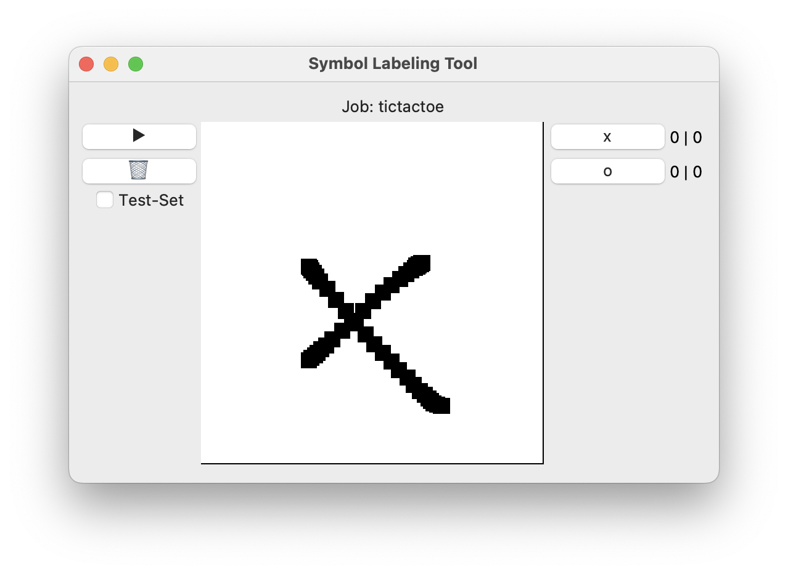

# Deep Learning zum Erkennen von handgeschriebenen Buchstaben und Zahlen

## Einleitung

Auch wenn die digitalen Medien und Hilfsmittel immer mehr Einzug in unseren Alltag bekommen, ist für die meisten immer noch am natürlichsten etwas mit der Hand zu schreiben. Das lässt sich auch davon ableiten, dass jedes moderne Tablett beispielsweise eine Unterstützung für einen Stift anbietet. Auch wenn das Erkennen von Handschrift keine neue Aufgabe für ein Deep Learning Modell ist, gibt es in diesem Bereich noch einige interessante Details. Modelle werden meistens an riesigen Datensätzen wie MNIST und EMNIST, in denen unzählige Beispiele für handgeschriebenen Buchstaben und Zahlen enthalten sind, trainiert. Dabei ist anzumerken, dass diese Beispiele von unterschiedlichen Menschen stammen. Dadurch werden robuste Modelle geschaffen, die ihr Wissen auf die große Varianz der Realität generalisieren können. Sollte jedoch ein Text extrahiert werden, bei der die Person eine sehr individuellen Stil pflegt und die Art und Weise der Schrift stark vom Durchschnitt abweicht, kann es dazu kommen, dass die Performance des Modells nicht ausreicht.

## Motivation

Immer mehr Aufgaben werden in der digitalen Welt erledigt und in unterschiedlicher Software umgesetzt. Ob bei der Erstellung von Texten, Bildbearbeitung oder beim Anlagen von Notizen, jedes mal wird die Kommunikation zwischen Mensch und Maschine über eine jeweilige Schnittstelle abgebildet. Diese Schnittstelle muss auf der einen Seite an die Bedürfnisse des Menschen angepasst und auf der anderen Seite für den Computer zu interpretieren sein. Dabei wurde in dieser Arbeit der Fokus auf das Anlagen von handschriftlichen Notizen gelegt. Vor allem über die Mobile Devices wie Tablets ist es heute möglich über einen speziellen Stift auch handschriftliche Notizen anzulegen und somit mit der jeweiligen Software zu interagieren. Dabei ist es essentiell, dass die Software alle Buchstaben, Ziffern und andere Zeichen präzise erkennen kann. Die Handschrift kann von Mensch zu Mensch stark varieren und durch weitere Einflussfaktoren, wie Behinderungen, Bildungsstand und Koordination zusätzlich vom durchschnittlichen Schriftbild abweichen. Mit der Hilfe von Deep Learning kann versucht werden durch die Eingaben vom Nutzer eine individuelle Repräsentation des Schriftbildes zu erlernen, um die Eingaben richtig extrahieren und weiterverabeiten zu können.

## Projekt

Das Projekt beschäftigt sich mit der Frage ob ein Modell zum Erkennen von Handschrift trainiert werden kann und sich dabei auf die Handschrift eines Individuum spezialisiert. Nach dem Prinzip der "Teachable Machine" könnte die Person das Modell auf seine eigene Handschrift trainieren, um so das Modell von Zeit zu Zeit weiter zu optimieren. Im Rahmen des Projektes wird ein Tool entwickelt, welches die Person auffordert unterschiedliche Buchstaben und Zahlen zu schreiben. Diese Eingaben werden genutzt, um einen gelabelten Datensatz zu erzeugen, der ausschließlich aus den Daten des Nutzers besteht. Auf Grundlage dieser Daten wird ein Deep Learning Modell trainiert und optimiert. Das Modell wird dabei vor die Aufgabe gestellt, bei gegebenem Input in Form eines Bildes den richtigen Buchstaben oder die richtige Zahl vorherzusagen. Damit wäre das ein Modell für eine Categorical Classification. Diese Vorhersagen werden dann mit gängigen Metriken aus dem Bereich der Klassifikation auf Qualität und Performance überprüft.

## Ziel

Ziel des Projektes ist es ein Proof-of-Concept für ein stark individualisiertes und spezialisiertes Deep Learning Modell im Bereich Computer Vision zu entwickeln. Dabei sollen auch die Unterschiede festgestellt werden, wie stark die Performance des Modells abweicht, wenn zusätzliche Datensätze oder nicht verwendet werden. Sollte festgestellt werden, dass auch mit einem kleinen Datensatz, welcher nur vom Nutzer erzeugt wurde, gute Ergebnisse erzielt werden könne, würde das einen weiteren Schritt darstellen, Deep Learning Modelle auch in einer Umgebung zu nutzen, wo keine riesigen Datenmengen vorhanden sind. Vorteil dabei wäre nicht nur die geringere benötigte Datenmenge sondern auch die kürzere Trainingszeit und damit kleinere finanzielle Ressourcen.

## Herangehensweise

Der Ablauf des Projektes ist in 9 Schritte aufgegliedert.

1. Implementierung eines GUI-Tool für die Generierung eines individuellen Datensatzes für unterschiedliche Buchstaben und Zahlen.
2. Sobald das Tool implementiert ist kann bereits angefangen werden Daten für den benötigten Datensatz zu erzeugen. Dieser Datensatz wird von der GUI-Anwendung in strukturierter Form im Arbeitsverzeichnis abgelegt und aufgeteilt.
3. Bevor ein Modell an den Daten trainiert werden kann müssen diese in geeigneter Form vorverarbeitet werden. Dabei werden die Daten über das Python-Modul Tensorflow geladen und umgewandelt.
4. Um ein vollwertiges Training an den Daten durchführen zu können, werden die Daten in ein Trainings-, Validierungs- und Test-Datensatz aufgeteilt.
5. Um den kleinen und individualisierten Datensatz synthetisch zu vergrößern, werden Methoden aus dem Bereich Image-Augmentation in die Vorverarbeitung integriert.
6. Im nächsten Schritt wird das Modell trainiert und mit den gängigen Metriken aus der Image-Classification evaluiert.
7. Der gleiche Vorgang wird noch einmal wiederholt mit dem Unterschied der Integration von zusätzlichen Daten.
8. Am Ende werden beide Modelle miteinander verglichen und die Ergebnisse der Performance gegenübergestellt.
9. Für einen weiteren Feldversuch werden beide Modelle in das bereits zuvor entwickelte GUI-Tool integriert und somit direkt gegen neue Benutzereingaben getestet.

### GUI

Im Grunde geht es um eine vereinfachte Darstellung für ein Interface zwischen Benutzer und Software. Dabei wurde der Prototyp in der Python Bibliothek tkinter entwickelt. Vorzustellen ist eine Einbindung in eine größere Desktop- oder Mobilapplikation um die Eingaben vom Benutzer direkt abzuspeichern. Damit soll verhindert werden, dass der Benutzer tatsächlich eine Data-Labeling Software nutzen muss, um die eigenen Handschrift erkennbar machen zu lassen. Vielmehr ist eine passivere Einbindung in ein vorhandes Konzept im Fokus. Beispielsweise könnte es als zusätzliches Plugin für gängige Notiz-Software verwendet werden e.g. GoodNotes, OneNote, ... . Im Zentrum der Desktopanwendung befindet sich eine Zeichenfläche, in der der Nutzer seine handschriftlichen Ziffern eintragen kann. Diese kann immer wieder zurückgesetzt werden, falls eine falsche Eingabe gemacht wird. Der eigentliche Ablauf des Data-Labeling besteht darin, dass der Nutzer seine Eingaben über die Maus oder ein Grafiktablett über die Zeichenfläche vornimmt und den Button der jeweiligen Klasse betätigt. Dadurch entsteht ein Datensatz der nach dem Schema des überwachten Lernens mit einem Machine Learning-Modell trainiert werden kann.


Über zwei Labels direkt neben jedem Klassifizierungs Button kann zu jederzeit abgelesen werden, wieviele Datensamples im Trainings- und Testordner vorhanden sind. Der Input des Datensatzes $x$ sind die Bilder, die in einer automatisch generierten Ordner Struktur abgelegt werden. Das $y$ und somit das target des Datensatzes wird über den jeweiligen Zielordner vergeben. Das bedeutet beispielsweise, dass ein Bild, welches mit der Klasse $3$ gelabelt wurde, auch in einen Ordner mit dem Klassennamen $3$ abgespeichert wird. Grundlegend ist die Ordnerstruktur eines in der GUI generierten Datensatzes nach dem folgendem Schema strukturiert:

```txt
.
├── digits
    ├── train
        ├── 0
        ├── 1
        ├── 2
        ├── 3
            ├── 0d803dab271e20ce8b806f01286f7e2d.png
            ├── 6bfa9b35035b90518c2754859da67b9a.png
            └── ...
    └── test
        ├── 0
        ├── 1
        ├── 2
        ├── 3
            ├── beb2223b6f79f874a946ef0922334443.png
            ├── cc4f300bc14d12abc18c884f46d541dc.png
            └── ...
```

Alle Bilder bekommen als Dateinamen einen `md5` Hashwert. Der Vorteil ist nicht nur, dass dadurch ein pseudo-zufäliger Dateiname entsteht, sondern auch die Vorbeugung von Duplikaten. Zu Duplikaten im Datensatz kann es deshalb nicht kommen, da der Hashwert aus dem Inhalt aller Pixel der vorliegenden `numpy` Datenstruktur generiert wurde. Die GUI und damit der Labeling-Prozess kann über eine Checkbox in 1 von zwei verschiedenen Zustände gebracht werden. Wenn sich die GUI im Trainings-Zustand befindet, werden alle generierten Daten in den Unterordner `train` sortiert. Sollte die Anwendung über die Checkbox in den Test-Zustand gebracht worden sein, werden jedoch alle Bilder in den Unterordner `test` abgelegt. Um beim Generieren eines Datantzes effektiv und präzise Arbeiten zu können, ist es wichtig, dass die Steuerung des Tools auch über die Tastatur möglich ist. Somit kann beim Generiereren der Daten mit einer Hand gezeichnet werden und mit der anderen die jeweilige Klasse über die Tastatur betätigt werden. Wird ein Bild gelabelt, wird automatisch die Zeichnenfläche zurückgesetzt, damit direkt mit der nächsten Eingabe fortgefahren werden kann. Die Anwendung wurde in allen ihren Komponenten generisch implementiert. Das bedeutet, dass nicht nur ein Datensatz mit den Labels $0, 1, 2, ..., 9$ generiert werden kann, sondern auch andere Schriftzeichen oder Symbole festgelegt werden. Die Art des Datensatzes und die enthaltenen Klassen, nennen wir folgend einen Labeling-Job. Ein Labeling-Job kann in diesem Prototyp über eine Konfigurations-JSON-Datei erzeugt werden. Diese ist wie folgt aufgebaut:

```json
{
    "name": "digits",
    "labels": [
        {"name": "0", "key": "0"},
        {"name": "1", "key": "1"},
        {"name": "2", "key": "2"},
        {"name": "3", "key": "3"},
        {"name": "4", "key": "4"},
        {"name": "5", "key": "5"},
        {"name": "6", "key": "6"},
        {"name": "7", "key": "7"},
        {"name": "8", "key": "8"},
        {"name": "9", "key": "9"}
    ]
}
```

Über die Konstante JOB_FILE im Quelltext der GUI, kann festlegt werden, auf Grundlage welcher Konfiguationsdatei die GUI gestartet und aufgebaut werden soll.

```python
JOB_FILE = "./digits.json"
```

Dadurch werden nicht nur der Inhalt der Buttons auf die jeweiligen Klassenbezeichnungen angepasst, sondern auch der Zielspeicherort des Datensatzes vorgegeben. Die komplette Ordnerstruktur wird vom Programm automatisch angelegt, sollte diese noch nicht existieren. Mit diesem generischen Aufbau ist es möglich, die GUI auch flexibel für die Generierung anderer Datensätze zu verwenden:



Der dazugehörige Job würde wie folgt aussehen:

```json
{
    "name": "tictactoe",
    "labels": [
        {"name": "x", "key": "x"},
        {"name": "o", "key": "o"}
    ]
}
```

### Datengenerierung

Im Bezug auf die Daten baut das Projekt auf zwei verschiedenen Datenquellen auf. Der eigene Datensatz für die handgeschriebenen Ziffern wird durch die eigene GUI vom Benutzer generiert. Dabei wurden für den Prototypen 50 Bilder pro Klasse im Trainingsdatensatz erzeugt und 10 Bilder pro Klasse für die Testdaten. Damit die Individualisierung des Modells hervorgehoben wird, wurden in dem generierten Datensatz alle Ziffern $2, 3$ und $5$ spiegelverkehrt geschrieben. Das bedeutet, dass der Datensatz mit 3 Klassen und damit 150 Samples viele handgeschriebene Ziffern enthält, die von der Norm abweichen und auch in dieser Form nicht im MNIST Datensatz zu finden sind.

### MNIST für pretraining

Wie eingangs bereits erläutert wird das Modell in zwei verschiedenen Varianten trainiert. Bei der 1. Variante wird lediglich der eigens generierte Datensatz verwendet. Die 2. Variante schiebt dem Training der eigenen Daten ein pretraining an dem offiziellen MNIST-Datensatz vor. Dabei sollten beide Varianten in den Resultaten miteinandern verglichen werden.

### Data preprocessing

Für die die Machine Learning Pipeline wird die Python Bibliothek `tensorflow` verwendet. Mit der Funktion `image_dataset_from_directory` kann ein Image-Datensatz direkt aus der vorhandenden Ordnerstruktur abgeleitet werden. Dadurch muss der Datensatz nicht mehr zusätzlich in ein strukturiertes tabellarisches Format mit den dazugehörigen Klassen Label $y$ gebracht werden, sondern kann durch die standardisierte Bennenung der Ordner und der Ordnerstruktur extrahiert werden. Die Funktion sorgt außerdem dafür, dass sowohl die eigenen Daten, als auch der MNIST-Datensatz nicht aufeinmal in den Arbeitsspeicher des Programms geladen werden, sondern nur eine Referenz auf einen Dataloader generiert wird. Dadurch werden die Bilder erst Gruppenweise während des Trainings in den RAM geladen und durch das Modell verwendet. Diese Implementierung ist vor allem bei Image-Classification essentiell, da die jeweiligen Datensätze oft aus tausendenen Bildern bestehen, welche nicht gleichzeitig im Arbeitsspeicher vorgehalten werden können. Für das Training wird das Mini-Batch-Verfahren verwendet. Das bedeutet, dass die Bilder nicht einzeln durch das Modell verarbeitet werden, sondern immer gruppiert in sogenannten Batches geladen werden. Dabei gibt die Batch-Size an, wie viele Samples sich einem Batch befinden. In dieser Implementierung wurde eine Batch-Size von 32 verwendet. Mit der Batch-Size wird auch der Grad der Parallelisierung gesteuert. Denn bei der Verwendung einer GPU beim Training kann die Geschwindigkeit des Trainings zusätzlich beschleunigt werden. Dabei kann die Batch-Size aber nicht unbegrenzt gesteigert werden, da alle Samples, die sich in einem Batch befinden, zum gleichen Zeitpunkt im Arbeitsspeicher befinden. Da das Test-Set in diesem Projekt aus 100 Samples besteht, kann dieses in einem einzigen Batch geladen werden und durch das Modell verarbeitet werden. Grundsätzlich wird im Bereich des Machine Learning der vorliegende Datensatz in mehrere Bestandteile aufgeteilt. Dadurch lässt sich nicht nur das Training zur Laufzeit steuern, sondern auch das bereits trainierte Modelle gegen ungesehende Daten testen. Dabei ist es wichtig, dass während der gesamten Pipeline in der Implementierung keine Informationen aus dem Test-Set in das Training leaken.

Die Trainings-Daten bestehen aus 100 Bildern (10 pro Klasse) und wurden aufgeteilt:

- Training: 80 %
- Validation: 20 %

Die Test-Daten bestehen aus 50 Bildern (10 pro Klasse):


### Modell

Da es sich um eine Image-Klassifikation handelt wird als Modell ein CNN verwendet. Diese bestehen aus mehreren Convolutional-Layers die eigene trainierbare Filter enthalten. Die Parameter dieser Filter werden während des Trainings angepasst und bilden dadurch verschiedene Muster und Features des Datensatzes ab. Grundlegend ist die Architektur des Modells in 5 Stufen abgebildet:

- Image Augmentation
- Rescaling  
- CNN
- FCN
- OutputLayer (probability distribution (softmax))

Zu Beginn werden die Daten durch unterschiedliche Image-Augmentation Layers geleitet. Dabei werden zufällige Veränderungen an den Daten vorgenommen. Werden folgende Funktionen zufällig angewendet:

- `tf.keras.layers.RandomRotation`   (Drehung: maximal 10 %)
- `tf.keras.layers.RandomZoom`       (Zoom: maximal 10 %)
- `tf.keras.layers.RandomContrast`   (Kontrastanpasung: maximal 10 %)
- `tf.keras.layers.RandomBrightness` (Helligskeitsanpassung: maximal 10 %)

Darauf folgend werden die Daten normalisiert, denn künstliche neuronale Netzwerke und der dazugehörige Optimierungsalgorithmus `Gradientenverfahren`, arbeiten robuster und schneller wenn die Daten normalisiert werden. Dabei werden die Daten so skaliert, dass sie einen Durchschnitt von $0$ und eine Standardabweichung von $1$ haben. Nach dem die Daten normalisiert wurden befindet sich das CNN in der Architektur. Dieses besteht aus 2 Convolutional-Layers. Jede dieser Layer wir gefolgt von einer Aktivierungsfunktion als Nichtliniearitätskomponente. Dabei wurde die Aktivierungsfunktion ReLU $f(x) = max(0, x)$ verwendet. Nach der Aktivierung wurde noch eine Droput- und eine MaxPooling-Layer verwendet. Die Dropout dient im Training als Regularisierungsmethode, denn dabei werden zufällige Aktivierungen durch die vorrangegangene Layer geblockt. Als Wahrscheinlichkeit dafür wurde der Parameter 0.2 verwendet. Dadurch wird eine Aktivierung mit einer Wahrscheinlichkeit von 20 % geblockt. Die Resultate werden folgend zusätzlich durch eine MaxPoolig-Layer zusammengefasst. Diese funktiert ähnlich einer Conv-Layer mit einem Filter. Die Parameter des Filter werden im Unterschied dazu, aber nicht trainiert sondern wenden lediglich eine Max Funktion auf den Bereich an. Das bedeutet, dass immer der höchste Wert im Filter genommen wird. Der Output der CNN-Komponente der Modell-Architektur ist im Grunde 2-Dimensional und mit Breite und Höhe ähnlich der Dimensionen der Eingangsbilder. Damit das Modell am Ende die Klassen $0, 1, 2, ..., 9$ vorhersagen kann, werden die Dimensionen der Daten in einem weiteren Schritt durch die Layer `tf.keras.layers.Flatten` aufgelöst und in einen eindimensionalen Vektor umgewandelt und in das FCN (Fully-Connected-Network) geleitet. Dort werden die Daten in einer `tf.keras.layers.Dense` verarbeitet und die Output-Layer gibt einen Vektor mit 10 Elementen (jeweils 1 pro Klasse) aus. Diese werden zusätzlich mit der Softmax-Aktivierungsfunktion aktiviert. Dadurch repräsentieren die 10 Werte eine Wahrscheinlichkeitsverteilung die in Summe genau 1 für 100 % Wahrscheinlichkeit ergibt. Dies ist eine essentielle Eigenschaft der Multiclass-Classification, da nur eine Klasse pro Input vorhanden sein kann. Ein Bild mit einer Ziffer kann beispielsweise nicht gleichzeitig der Klasse $3$ und $7$ zugeordnet sein. Als Optimierungsverfahren für die Anpassung der Gewichtungen während des Trainings wurde Adam mit einer learning_rate von $0.001$ verwendet. Der Aufbau des Modells lässt sich mit der Ausgabe der `model.summary` Funktion ausgeben:

```txt
Model: "sequential"
_________________________________________________________________
 Layer (type)                Output Shape              Param #   
=================================================================
 random_rotation (RandomRota  (None, 28, 28, 1)        0         
 tion)                                                           
                                                                 
 random_zoom (RandomZoom)    (None, 28, 28, 1)         0         
                                                                 
 random_contrast (RandomCont  (None, 28, 28, 1)        0         
 rast)                                                           
                                                                 
 random_brightness (RandomBr  (None, 28, 28, 1)        0         
 ightness)                                                       
                                                                 
 rescaling (Rescaling)       (None, 28, 28, 1)         0         
                                                                 
 conv2d (Conv2D)             (None, 26, 26, 32)        320       
                                                                 
 dropout (Dropout)           (None, 26, 26, 32)        0         
                                                                 
 max_pooling2d (MaxPooling2D  (None, 13, 13, 32)       0         
 )                                                               
                                                                 
 conv2d_1 (Conv2D)           (None, 11, 11, 32)        9248      
                                                                 
 dropout_1 (Dropout)         (None, 11, 11, 32)        0         
                                                                 
 max_pooling2d_1 (MaxPooling  (None, 5, 5, 32)         0         
 2D)                                                             
                                                                 
 flatten (Flatten)           (None, 800)               0         
                                                                 
 dense (Dense)               (None, 10)                8010      
                                                                 
=================================================================
Total params: 17,578
Trainable params: 17,578
Non-trainable params: 0
_________________________________________________________________
```

### Training

Während des Trainings werden die Vorhersagen des Modells mit den vorliegenden Labels verglichen. Daraus ergibt sich ein Fehler oder auch Abweichung, welche durch die Loss-Function berechnet wird. Da es sich um eine Multiclass-Classification handelt wurde die Funktion `tf.keras.losses.SparseCategoricalCrossentropy` verwendet. Während des Trainings werden außerdem die Validierungs-Daten vorgehalten. Damit der Trainingsablauf überwacht und Live die Güte des Modells eingeschätzt werden kann, werden nach jeder Epoche die Accuracy und der Loss ausgegeben. Die formale Definition der Accuracy ist $acc = \frac{Richtige Vorhersagen}{Anzahl der gesamten Vorhersagen}$. Das Modell wurde genau 100 Epochen trainiert. Wenn der Parameter `PRETRAIN` im Programm gesetzt ist, wird das Modell vor dem eigenen Datensatz für 10 Epochen an dem MNIST-Datensatz trainiert. 

```txt
1875/1875 [==============================] - 172s 89ms/step - loss: 0.3113 - accuracy: 0.9031 - val_loss: 0.1001 - val_accuracy: 0.9705
Epoch 2/10
1875/1875 [==============================] - 162s 86ms/step - loss: 0.1329 - accuracy: 0.9598 - val_loss: 0.0752 - val_accuracy: 0.9761
Epoch 3/10
1875/1875 [==============================] - 103s 55ms/step - loss: 0.1052 - accuracy: 0.9677 - val_loss: 0.0620 - val_accuracy: 0.9799
Epoch 4/10
1875/1875 [==============================] - 85s 45ms/step - loss: 0.0910 - accuracy: 0.9722 - val_loss: 0.0574 - val_accuracy: 0.9818
Epoch 5/10
1875/1875 [==============================] - 94s 50ms/step - loss: 0.0821 - accuracy: 0.9750 - val_loss: 0.0447 - val_accuracy: 0.9848
Epoch 6/10
1875/1875 [==============================] - 75s 40ms/step - loss: 0.0754 - accuracy: 0.9770 - val_loss: 0.0482 - val_accuracy: 0.9838
Epoch 7/10
1875/1875 [==============================] - 76s 41ms/step - loss: 0.0701 - accuracy: 0.9782 - val_loss: 0.0435 - val_accuracy: 0.9862
Epoch 8/10
1875/1875 [==============================] - 77s 41ms/step - loss: 0.0664 - accuracy: 0.9795 - val_loss: 0.0422 - val_accuracy: 0.9859
Epoch 9/10
1875/1875 [==============================] - 75s 40ms/step - loss: 0.0623 - accuracy: 0.9804 - val_loss: 0.0379 - val_accuracy: 0.9892
Epoch 10/10
1875/1875 [==============================] - 94s 50ms/step - loss: 0.0601 - accuracy: 0.9809 - val_loss: 0.0407 - val_accuracy: 0.9869
```

Mit einer Lernkurve können die zwei Metriken Loss und Accuracy des Trainings visualisiert werden, um damit überprüfen zu können ob das Modell funktioniert und Probleme wie z.B. High-Varriance ("Over-Fitting") auftreten.


### Modell Evaluation

Nach dem Training werden die Test-Daten in das Modell gegeben um die dazugehörigen Vorhersgen zu bekommen. Dabei wird mit der Funktion `np.argmax` das Label extrahiert, welches in dem Ausgabe Vektor mit 10 Elementen die höchste Wahrschienlichkeit hat. Nach dem Training erreichten die Modelle folgende Accuracy:

| Modell | Accuracy |
|----|----|
| ohne Pretrain | 0.93 |
| mit Pretrain | 0.96 | 

Mit dem Precision und dem Recall Score wurden zusätzliche Evaluierungs-Metriken geschaffen, um die Güte des Modells zu überprüfen. Dabei gibt die Precision an, wie hoch der Anteil der richtigen Vorhersagen in einer Klasse waren. Der Recall gibt im Unterschied dazu an wie viele Klassen das Modell im Bezug auf die Gesamtheit gefunden hat. Beispielsweise enthält ein Datensatz 50 Bilder mit der Ziffer 9 und das Modell hat 40 davon gefunden und richtig vorhergesagt, dann wäre der dazugehörhige Recall-Score 80 %.

| Label | Precision | Recall | Precision (pretrained) | Recall (pretrained) |
|-------|-----------|--------|------------------------|---------------------|
|   0   |  1        |  1 | 1 | 1 |        
|   1   |  1        |  1 | 1 | 1 |
|   2   |  0.83     |  0.91 | 0.83 | 0.91 |
|   3   |  0.91     |  1 | 1 | 1 |
|   4   |  1        |  0.9 | 1 | 0.9 |
|   5   |  0.88     |  0.58 | 1 | 0.83 |
|   6   |  0.91     |  1 | 0.91 | 1 |
|   7   |  0.75     |  0.9 | 0.91 | 1 |
|   8   |  1        |  1 | 1 | 1 |
|   9   |  1        |  1 | 1 | 1 |

Mit der Confusion Matrix wird die Gegenbüberstellung von den richtigen Labels `y_test` und den vorhergesagten Labels vom Modell `y_pred` visualisiert. Dabei befinden sich die richtigen Vorhersagen auf der Diagonalen. Damit dient die Confusion Matrix dazu, Abweichungen nicht nur zu erkennen, sondern auch den Bereich einzuordnen, mit welchen Inputs das Modell weiterhin Schwierigkeiten hat. Bei größeren Datensätzen können dadurch auch inkonsistente und Samples mit einer schlechten Qualität identifieziert werden.


### Model Saving

Auch wenn das Training des Modells beim vorliegenden Projekt in unter 10 min durchgeführt werden kann, ist es nicht praktisch für jede neue Verwendung des Modells zum Vorhersagen von neuen Samples, wieder ein vollständiges Training durchzuführen. Deshalb wurde mit der `model.save` Funktion von tensorflow das Modell abgespeichert. Dabei werden alle Gewichtungen und auch die Architektur des Modells in eine Datei geschrieben, die im gleichen oder in einem anderen Programm zu einem späterem Zeitpunkt wieder geladen werden kann. Diese Funktionalität wurde unter anderem dafür genutzt, um das fertig trainierte Modell im Programm der GUI zu laden. Damit wurde die Funktionalität gebaut, dass die GUI dafür genutzt werden kann, neue Ziffern zu schreiben und sich dann direkt eine Vorhersage durch das Modell zu holen. Somit kann das Modells auch Live vom Benutzer getestet werden.

## Fazit

Die Implementierung hat gezeigt, dass ein Deep Learning Modell in der Lage ist die individuelle Handschrift extrahieren zu können. Dabei ist es in der Lage auch falsch geschrieben Zeichen richtig zu dekodieren. Im Zusammenhang mit Image-Augmentation können die Ergebnisse mit einem kleinem Datensatz erzielt werden, welcher lediglich aus 500 Samples besteht. Weiterhin hat das Training gezeigt, dass das Voranstellen eines Pretraining an einem standardisierten und größeren Datensatz einen positiven Effekt auf die Performance haben kann. Dies könnte bedeuten, dass das Modell am größeren Datensatz das allegemeine Konzept der handgeschriebenen Zeichen und grundlegende Muster erlernt und sich in einem weiteren Schritt beim Training am eigenen Datensatz auf die indiviuelle vorlioegende Schreibweise spezialisieren kann und dabei auch auf falsche oder ungenaue Schreibweisen des Indivduum anpassen kann.

## Ausblick

Mit Ausblick auf eine zukünftige Erweiterung des Modells wäre es interessant, die vorliegende Logik in größere Anwendungsoftware zu integrieren. Somit wäre es denkbar, dass es als Erweiterung bei Programmen wie GoodNotes, OneNote oder ähnlichen eingesetzt wird, um dem Nutzer zusätzliche Funktionalität im Bezug auf die seine eigenen handgeschriebenen Notizen zu geben. Dabei wären Features wie die Durchsuchbarkeit, Umwandlung zu machinengeschriebener PDF oder auch automatischer Fehlerkorrektur denkbar. Im Zuge der Weiterentwicklung könnte der Datensatz generisch um weitere Symbole und Zeichen erweitert werden. Auch wenn das Modell im ersten Versuch bereits gute Ergebnisse geliefert hat, könnten bei der weiteren Entwkclung auch andere Architekturen aus dem Bereich Deep Leanring und dort spezielle den CNNs getestet werden. Dabei sollte weiterhin der Fokus auf kleine Modelle gelegt werden, damit das Programm weiterhin direkt beim Endnutzer liegen und trainiert werden kann.